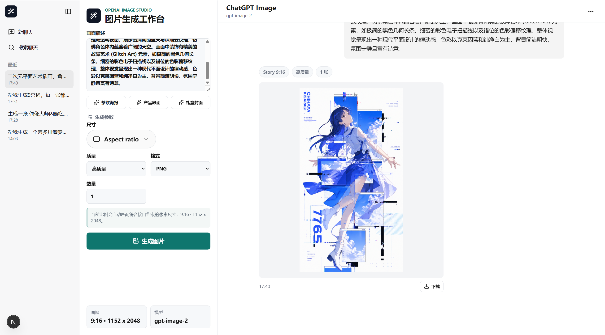

# OpenAI Image Studio / ChatGPT Images 2

一个基于 Next.js App Router、React、TypeScript 和 OpenAI Images API 的图片生成工作台。

项目提供接近 ChatGPT 图片工作台的三栏式交互界面，支持画幅选择、质量与格式控制、最近记录持久化、聊天记录搜索、图片缩放查看、图片下载，以及带缓存与监控能力的服务端代理接口。

## 界面预览



## 目录

- [项目特性](#项目特性)
- [技术栈](#技术栈)
- [项目结构](#项目结构)
- [快速开始](#快速开始)
- [环境变量说明](#环境变量说明)
- [使用说明](#使用说明)
- [画幅与参数约束](#画幅与参数约束)
- [API 接口说明](#api-接口说明)
- [最近记录机制](#最近记录机制)
- [代理能力说明](#代理能力说明)
- [常用命令](#常用命令)
- [常见问题](#常见问题)
- [相关文档](#相关文档)

## 项目特性

### 1. ChatGPT 风格图片工作台

- 左侧为最近记录栏，支持折叠侧栏、搜索聊天、新建聊天。
- 中间为参数控制区，集中管理提示词、画幅、质量、格式和数量。
- 右侧为聊天式结果区，展示提示词、参数标签、图片结果和下载入口。

### 2. 适合图片生成的参数控制

- 支持 5 种官网同款画幅比例：`1:1`、`3:4`、`9:16`、`4:3`、`16:9`。
- 支持质量选项：`low`、`medium`、`high`。
- 支持输出格式：`png`、`jpeg`、`webp`。
- 支持单次生成 `1~4` 张图片。

### 3. 最近记录持久化

- 生成成功后会自动保存最近记录。
- 页面刷新后可恢复最近会话。
- 本地历史默认保留最近 `12` 条记录。
- 完整图片会保存到 `.local/generated-images/`，历史 JSON 只保存轻量 URL，避免 base64 记录膨胀。
- 历史记录保存在本地运行目录 `.local/` 中，不提交到 Git。

### 4. 图片预览与查看体验

- 聊天区缩略结果会按可视区域自动缩放，完整展示图片构图。
- 点击图片可进入大图查看器。
- 查看器支持放大、缩小、重置缩放和下载。

### 5. 服务端代理能力

- 支持单密钥或多密钥轮转。
- 支持请求缓存，减少重复调用成本。
- 支持本地内存限流，避免误操作或脚本刷爆额度。
- 支持最近请求日志和代理统计信息。
- 代理统计接口需要 `PROXY_ADMIN_TOKEN` 访问令牌。
- 支持自定义 `OPENAI_BASE_URL` 对接中转服务。

### 6. 中文化交互与错误提示

- 前端交互文案为中文。
- 请求参数错误会返回中文提示。
- 服务端统一整理 OpenAI 错误信息，避免把原始 SDK 异常直接暴露到前端。

## 技术栈

| 类别 | 说明 |
| --- | --- |
| 前端框架 | Next.js App Router |
| UI | React + CSS |
| 语言 | TypeScript |
| 图标 | `lucide-react` |
| 接口调用 | `openai` |
| 参数校验 | TypeScript + 自定义约束逻辑 |
| 运行方式 | Node.js Runtime Route Handlers |
| 测试 | Node 内置 `node:test` |

## 项目结构

```text
.
├─ README.md
├─ .env.example
├─ package.json
├─ docs/
│  ├─ index.png
│  ├─ PROXY_GUIDE.md
│  ├─ QUICKSTART.md
│  └─ ui-review.png
├─ src/
│  ├─ app/
│  │  ├─ globals.css
│  │  ├─ layout.tsx
│  │  ├─ page.tsx
│  │  └─ api/
│  │     ├─ generation-history/image/route.ts
│  │     ├─ generation-history/route.ts
│  │     ├─ images/generate/route.ts
│  │     └─ proxy/stats/route.ts
│  ├─ components/image-studio/
│  │  ├─ ChatPanel.tsx
│  │  ├─ ControlPanel.tsx
│  │  ├─ HistoryRail.tsx
│  │  ├─ ImageViewer.tsx
│  │  └─ types.ts
│  └─ lib/
│     ├─ admin-auth.ts
│     ├─ download-filename.ts
│     ├─ generation-history.ts
│     ├─ generation-history-store.ts
│     ├─ generation-history-types.ts
│     ├─ image-options.ts
│     ├─ openai-retry.ts
│     ├─ openai-error.ts
│     ├─ proxy-config.ts
│     ├─ proxy-handler.ts
│     ├─ proxy-middleware.ts
│     └─ rate-limit.ts
└─ test/
   ├─ download-filename.test.ts
   ├─ generation-history-store.test.ts
   ├─ generation-history.test.ts
   ├─ image-options.test.ts
   ├─ openai-error.test.ts
   └─ proxy.test.ts
```

## 快速开始

### 1. 安装依赖

```bash
npm install
```

### 2. 配置环境变量

复制示例文件并创建本地配置：

```bash
cp .env.example .env.local
```

Windows 命令行也可以使用：

```bat
copy .env.example .env.local
```

然后编辑 `.env.local`：

```env
# OpenAI 密钥（二选一）
OPENAI_API_KEY=sk-your-api-key
# OPENAI_API_KEYS=sk-key-1,sk-key-2,sk-key-3

# 图片模型
OPENAI_IMAGE_MODEL=gpt-image-2

# 可选：中转 API 地址（通常建议包含 /v1）
OPENAI_BASE_URL=

# 代理相关
ENABLE_PROXY_CACHE=true
PROXY_CACHE_DURATION=3600
PROXY_CACHE_MAX_ENTRIES=50
ENABLE_REQUEST_LOG=true

# 本地防滥用
IMAGE_RATE_LIMIT_MAX=10
IMAGE_RATE_LIMIT_WINDOW_MS=60000

# 代理监控访问令牌
PROXY_ADMIN_TOKEN=change-me
```

### 3. 启动开发服务

```bash
npm run dev
```

默认访问地址：

```text
http://localhost:3000
```

### 4. 构建生产版本

```bash
npm run build
```

### 5. 运行测试

```bash
npm test
```

## 环境变量说明

| 变量名 | 是否必需 | 默认/示例 | 说明 |
| --- | --- | --- | --- |
| `OPENAI_API_KEY` | 否* | `sk-...` | 单个 OpenAI API Key。 |
| `OPENAI_API_KEYS` | 否* | `sk-a,sk-b` | 多个 Key，逗号分隔，用于轮转。 |
| `OPENAI_IMAGE_MODEL` | 是 | `gpt-image-2` | 图片生成模型名称。 |
| `OPENAI_BASE_URL` | 否 | 空 | 中转地址或自定义 API 地址，通常建议包含 `/v1`。 |
| `ENABLE_PROXY_CACHE` | 否 | `true` | 是否启用代理缓存。 |
| `PROXY_CACHE_DURATION` | 否 | `3600` | 缓存有效期，单位秒。 |
| `PROXY_CACHE_MAX_ENTRIES` | 否 | `50` | 内存缓存最多保留的图片请求结果数量。 |
| `ENABLE_REQUEST_LOG` | 否 | `true` | 是否记录最近请求日志。 |
| `IMAGE_RATE_LIMIT_MAX` | 否 | `10` | 单个客户端在窗口期内最多生成请求数。 |
| `IMAGE_RATE_LIMIT_WINDOW_MS` | 否 | `60000` | 生成接口限流窗口，单位毫秒。 |
| `PROXY_ADMIN_TOKEN` | 是 | `change-me` | 访问 `/api/proxy/stats` 的令牌。 |

> `OPENAI_API_KEY` 和 `OPENAI_API_KEYS` 至少配置一个。

## 使用说明

### 1. 输入提示词

在页面中部输入画面描述，建议尽量说明以下信息：

- 主体
- 场景
- 构图
- 光线
- 风格
- 用途（海报、封面、电商图、UI 等）

示例：

```text
高级茶饮品牌海报，白瓷杯、柔和自然光、干净背景，适合电商首图
```

### 2. 选择画幅与输出参数

可配置以下内容：

- 画幅比例
- 输出质量
- 输出格式
- 生成数量

页面按 ChatGPT 官网交互展示画幅比例。选择比例时，会把 `Make the aspect ratio x:y` 追加到提示词末尾；接口层仍使用稳定支持的像素尺寸：

| 展示名称 | 比例 | 实际提交尺寸 | 追加提示词 |
| --- | --- | --- | --- |
| Square | `1:1` | `1024x1024` | `Make the aspect ratio 1:1` |
| Portrait | `3:4` | `1024x1536` | `Make the aspect ratio 3:4` |
| Story | `9:16` | `1024x1536` | `Make the aspect ratio 9:16` |
| Landscape | `4:3` | `1536x1024` | `Make the aspect ratio 4:3` |
| Widescreen | `16:9` | `1536x1024` | `Make the aspect ratio 16:9` |

### 3. 查看结果

生成成功后，右侧聊天区会显示：

- 用户输入的提示词
- 本次生成使用的画幅、质量和数量标签
- 等比缩放后的图片预览
- 每张图片的下载按钮

### 4. 使用历史功能

左侧侧栏支持：

- **新聊天**：清空当前表单和结果，快速开始新会话。
- **搜索聊天**：按标题、提示词、画幅、质量、时间搜索最近记录。
- **折叠侧栏**：收起左侧栏，扩大中间与右侧展示空间。

### 5. 大图查看

点击结果图可打开查看器，支持：

- 放大
- 缩小
- 重置缩放
- 下载原图
- 关闭查看器

## 画幅与参数约束

### 预设尺寸

接口层支持以下预设尺寸：

- `1024x1024`
- `1536x1024`
- `1024x1536`

非标准像素尺寸会直接返回参数错误；需要 3:4、9:16、4:3、16:9 这类构图比例时，请通过画幅菜单追加对应提示词。

### 质量参数

可选值：

- `low`
- `medium`
- `high`

### 输出格式

可选值：

- `png`
- `jpeg`
- `webp`

### 数量参数

可选范围：

- 最小 `1`
- 最大 `4`

## API 接口说明

### 1. 生成图片

```http
POST /api/images/generate
Content-Type: application/json
```

请求示例：

```json
{
  "prompt": "未来感图片生成控制台 UI，深浅混合界面，专业产品摄影风格",
  "size": "1536x1024",
  "quality": "high",
  "outputFormat": "png",
  "count": 1
}
```

成功响应示例：

```json
{
  "images": [
    {
      "id": "1714310400000-0",
      "dataUrl": "/api/generation-history/image?sessionId=1714310400000-uuid&imageId=1714310400000-0",
      "mimeType": "image/png"
    }
  ],
  "model": "gpt-image-2",
  "usage": {
    "total_tokens": 1234,
    "input_tokens": 456,
    "output_tokens": 778
  },
  "session": {
    "id": "1714310400000-uuid",
    "title": "未来感图片生成控制台 UI",
    "prompt": "未来感图片生成控制台 UI，深浅混合界面，专业产品摄影风格",
    "size": "1536x1024",
    "sizeLabel": "Landscape 3:2",
    "sizeValue": "3:2 · 1536 x 1024",
    "qualityLabel": "高质量",
    "outputFormat": "png",
    "count": 1,
    "images": [
      {
        "id": "1714310400000-0",
        "dataUrl": "/api/generation-history/image?sessionId=1714310400000-uuid&imageId=1714310400000-0",
        "mimeType": "image/png"
      }
    ],
    "model": "gpt-image-2",
    "usage": {
      "total_tokens": 1234,
      "input_tokens": 456,
      "output_tokens": 778
    },
    "createdAt": "14:03"
  },
  "cached": false
}
```

### 2. 获取最近记录

```http
GET /api/generation-history
```

响应示例：

```json
{
  "sessions": [
    {
      "id": "1714310400000-uuid",
      "title": "茶饮海报设计",
      "prompt": "高级茶饮品牌海报，白瓷杯、柔和自然光、干净背景，适合电商首图",
      "size": "1024x1024",
      "sizeLabel": "Square 1:1",
      "sizeValue": "1:1 · 1024 x 1024",
      "qualityLabel": "平衡",
      "outputFormat": "png",
      "count": 1,
      "images": [
        {
          "id": "1714310400000-0",
          "dataUrl": "/api/generation-history/image?sessionId=1714310400000-uuid&imageId=1714310400000-0",
          "mimeType": "image/png"
        }
      ],
      "model": "gpt-image-2",
      "usage": null,
      "createdAt": "14:03"
    }
  ]
}
```

### 3. 查看代理统计

```http
GET /api/proxy/stats
Authorization: Bearer <PROXY_ADMIN_TOKEN>
```

响应内容包括：

- 当前时间戳
- Key 轮转统计
- 缓存统计
- 最近请求日志

### 4. 清空代理缓存

```http
POST /api/proxy/stats
Content-Type: application/json
Authorization: Bearer <PROXY_ADMIN_TOKEN>
```

请求示例：

```json
{
  "action": "clear-cache"
}
```

响应示例：

```json
{
  "message": "缓存已清空",
  "cache": {
    "cacheSize": 0,
    "maxCacheEntries": 50,
    "maxCacheAge": 3600000,
    "requestLogSize": 0
  }
}
```

## 最近记录机制

最近记录能力用于让页面刷新后恢复工作上下文：

- 保存位置：项目根目录下的 `.local/generation-history.json`
- 图片文件位置：项目根目录下的 `.local/generated-images/`
- 保存时机：每次图片生成成功后
- 保留数量：最近 `12` 条
- 存储内容：标题、提示词、尺寸标签、质量标签、输出格式、图片访问 URL、模型名、token 用量、创建时间
- 兼容策略：读取旧版 base64 历史时会自动把图片落盘，并瘦身历史 JSON
- 容错策略：即使保存失败，也不会阻塞图片生成主流程

## 代理能力说明

### 多密钥轮转

当配置 `OPENAI_API_KEYS` 时，系统可在多个 Key 之间轮转，降低单 Key 压力。

### 请求缓存

启用缓存后，相同请求可复用结果，减少重复调用。
缓存默认 1 小时过期，并最多保留 `50` 条结果；可通过 `PROXY_CACHE_DURATION` 和 `PROXY_CACHE_MAX_ENTRIES` 调整。

### 请求限流

生成接口默认按客户端地址限制为每分钟 `10` 次请求，避免误操作或脚本快速消耗额度。

### 请求日志

代理会记录最近请求，便于调试生成失败、排查缓存命中情况和观察接口表现。

### 监控鉴权

`/api/proxy/stats` 需要在请求头中提供 `Authorization: Bearer <PROXY_ADMIN_TOKEN>` 或 `x-proxy-admin-token`。

### 中转地址支持

如果你使用第三方中转服务或自建代理，可以设置：

```env
OPENAI_BASE_URL=https://your-proxy.example.com/v1
```

## 常用命令

| 命令 | 说明 |
| --- | --- |
| `npm install` | 安装依赖 |
| `npm run dev` | 启动开发环境 |
| `npm run build` | 构建生产版本 |
| `npm test` | 运行测试 |
| `npm run lint` | 执行代码检查 |

## 常见问题

### 1. 启动后无法生成图片

建议依次检查：

- `.env.local` 是否存在
- `OPENAI_API_KEY` 或 `OPENAI_API_KEYS` 是否填写正确
- 账户额度是否充足
- `OPENAI_BASE_URL` 是否配置错误
- 当前模型名称是否可用

### 2. 尺寸或画幅提示无效

直接调用 API 时，请确认 `size` 是以下三个标准值之一：

- `1024x1024`
- `1536x1024`
- `1024x1536`

页面上选择画幅比例时，会自动把 `Make the aspect ratio x:y` 写入提示词；如果手动删除了这句，模型就只会按普通提示词生成。

### 3. 历史记录没有恢复

请检查：

- 服务端是否有写入 `.local/` 目录的权限
- 本地环境是否清空了运行目录
- 是否在生成成功后立即关闭了服务

### 4. 页面能打开但图片不显示

建议检查：

- 生成接口是否返回 `images`
- 响应中的 `dataUrl` 是否完整
- 浏览器控制台是否有资源或内存错误

### 5. 为什么有缓存命中或结果重复

如果启用了代理缓存，相同请求参数可能直接命中缓存。这通常是正常现象，可通过接口手动清理缓存。

## 相关文档

- [快速启动文档](./docs/QUICKSTART.md)
- [代理实现说明](./docs/PROXY_GUIDE.md)
- [界面检查截图](./docs/ui-review.png)

## 说明

本项目更适合作为以下场景的基础模板：

- OpenAI 图片生成控制台
- 企业内部图片工作台
- 接入中转代理的图片生成前端
- 具备最近记录和下载能力的图像应用

如果你准备继续扩展，建议优先考虑：

- 增加用户鉴权
- 将本地历史改为数据库存储
- 引入对象存储保存图片结果
- 增加队列、限流和审计能力
- 增加更多生成参数和模型切换能力
